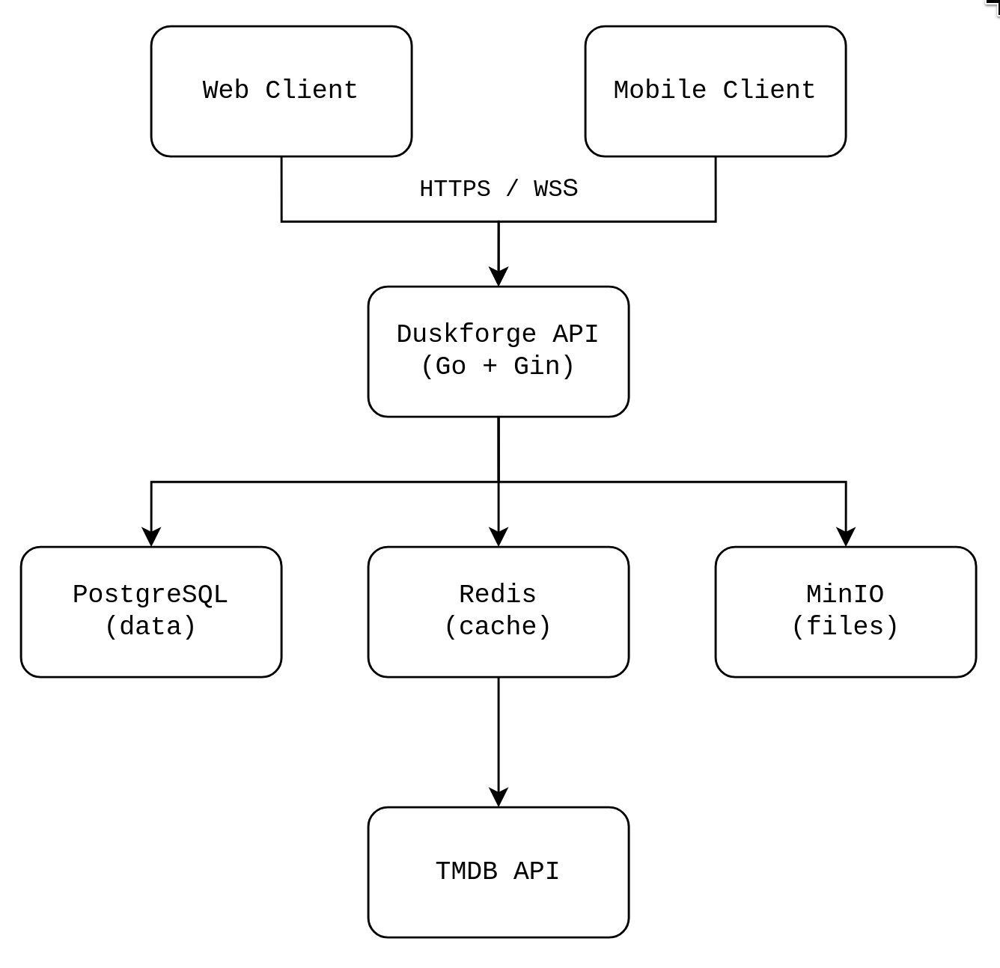
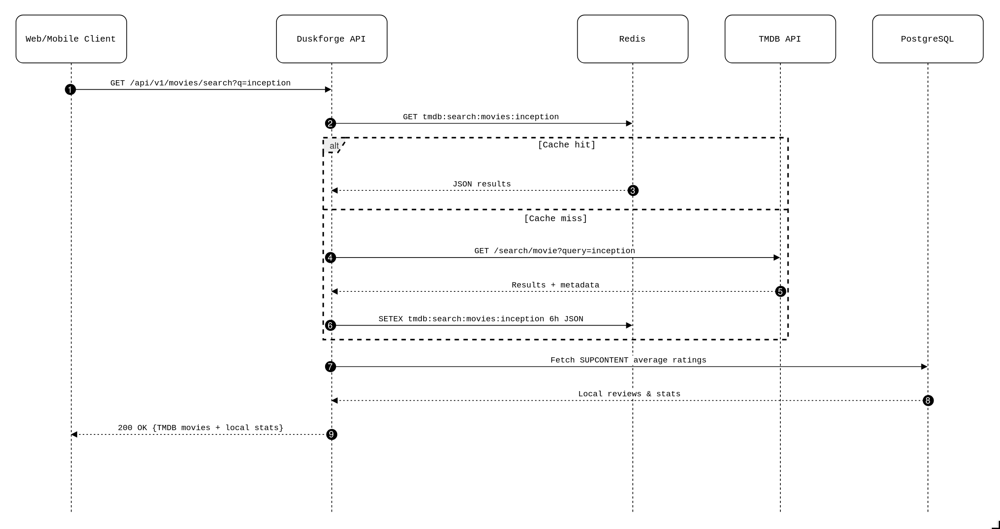
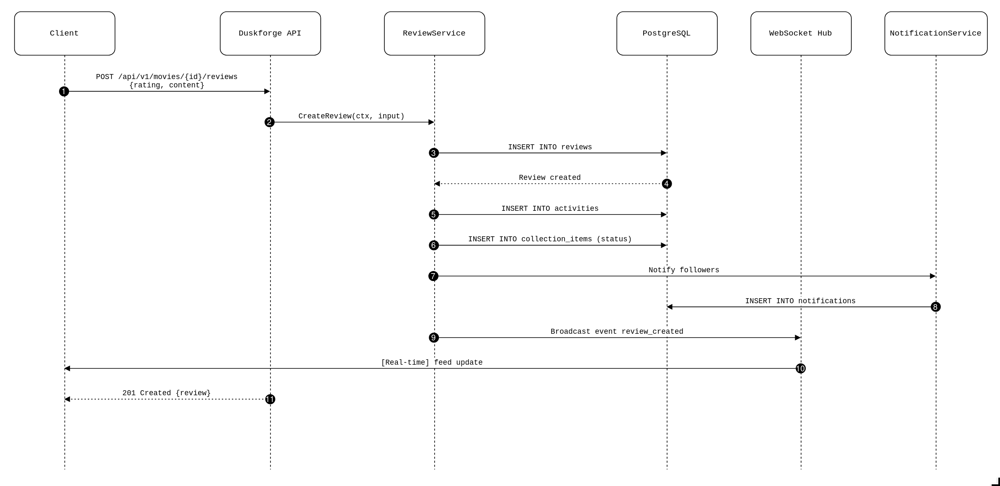
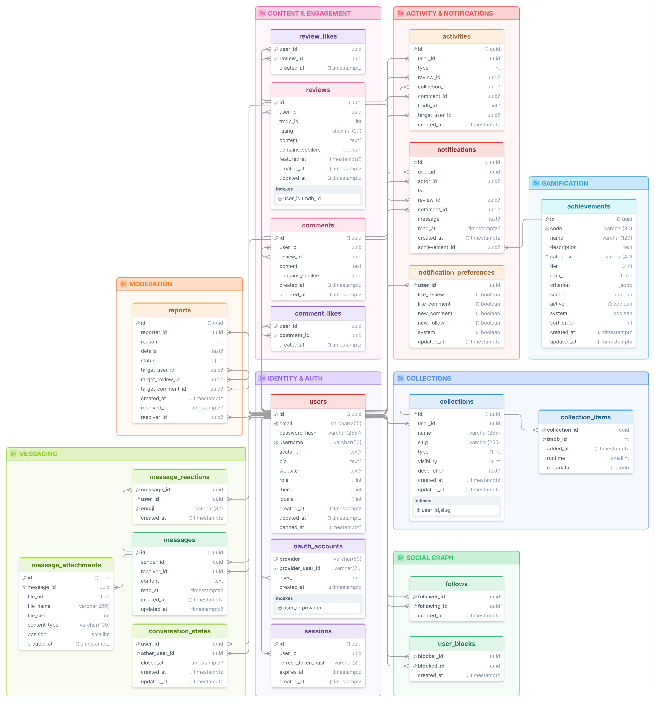

# Technical Documentation : Duskforge API

## Table of Contents

1. [Overview](#1-overview)
2. [Prerequisites & Installation](#2-prerequisites--installation)
3. [Deployment Guide](#3-deployment-guide)
4. [Technology Choices](#4-technology-choices)
5. [System Architecture](#5-system-architecture)
6. [Third-Party API Integration (TMDB)](#6-third-party-api-integration-tmdb)
7. [UML Diagrams](#7-uml-diagrams)
8. [Database Schema](#8-database-schema)
9. [Security & Compliance](#9-security--compliance)

---

## 1. Overview

**Duskforge** is the REST backend for a social network for movie enthusiasts. It acts as the sole gateway between the clients (web and mobile) and the external ecosystem, particularly The Movie Database (TMDB).

The API is built around a simplified **hexagonal architecture** (ports & adapters) and exposes a REST interface documented in OpenAPI (Swagger). It handles all business logic: authentication, collections, reviews, social interactions, messaging, moderation, and real-time notifications.

### Architecture Highlights

- **No business logic on clients**: web and mobile apps only communicate with the Duskforge backend.
- **Smart TMDB caching**: Redis acts as a buffer to avoid redundant calls to the external API.
- **Real-time**: a WebSocket hub centralizes notifications and social events.
- **Extensibility**: multi-key TMDB support, layered structure, and dependency injection make maintenance easy.

---

## 2. Prerequisites & Installation

### 2.1 Required Environment

| Tool | Minimum Version | Purpose |
|------|----------------|---------|
| Go | 1.25.5 | Server language |
| Docker | 24.x | Containerization |
| Docker Compose | 2.x | Local orchestration |

> **Note**: if you want to run the API outside Docker, you will also need PostgreSQL 16+, Redis 7.x, and MinIO installed locally.

### 2.2 Obtaining Third-Party API Keys

#### TMDB (required)

1. Create an account at [https://www.themoviedb.org](https://www.themoviedb.org).
2. Go to **Settings > API** in your profile.
3. Request an API key (free developer plan).
4. Copy the key into your `.env` file under the `TMDB_API_KEY` variable.

> You can provide multiple keys separated by commas for round-robin rotation in case of rate-limiting: `TMDB_API_KEY=key1,key2,key3`.

#### Brevo (required for email sending)

1. Sign up at [https://www.brevo.com](https://www.brevo.com).
2. Generate an API v3 key in **SMTP & API > API Keys**.
3. Fill in `BREVO_API_KEY` and the sender address (`EMAIL_FROM_ADDRESS`).

#### OAuth2 (optional)

- **GitHub**: [Settings > Developer settings > OAuth Apps](https://github.com/settings/developers)
- **Google**: [Google Cloud Console > APIs & Services > Credentials](https://console.cloud.google.com/apis/credentials)

For each provider, retrieve the `Client ID` and `Client Secret`, then add them to `.env`.

### 2.3 Local Installation (Developer Mode)

```bash
git clone git@github.com:r-witz/3PROJ-API.git
cd 3PROJ-API

cp .env.example .env
# Edit .env with your secrets and local settings.

docker compose up -d db redis minio

go mod download
go run ./cmd/api/main.go
```

The server starts by default on port `8080`. Swagger documentation is available at: `http://localhost:8080/docs/index.html`.

### 2.4 Minimal .env File (Development)

```env
SERVER_PORT=8080
CORS_ALLOWED_ORIGINS=*
LOG_LEVEL=debug

ACCESS_TOKEN_SECRET=dev-access-secret-min-32-chars-long
ACCESS_TOKEN_EXPIRY=15m
REFRESH_TOKEN_SECRET=dev-refresh-secret-min-32-chars-long
REFRESH_TOKEN_EXPIRY=168h

POSTGRES_HOST=localhost
POSTGRES_PORT=5432
POSTGRES_USER=duskforge
POSTGRES_PASSWORD=duskforge
POSTGRES_DB=duskforge
POSTGRES_SSLMODE=disable

REDIS_HOST=localhost
REDIS_PORT=6379
REDIS_DB=0

MINIO_HOST=localhost
MINIO_PORT=9000
MINIO_ACCESS_KEY=minioadmin
MINIO_SECRET_KEY=minioadmin
MINIO_BUCKET=duskforge
MINIO_USE_SSL=false
MINIO_PUBLIC_URL=http://localhost:9000

TMDB_API_KEY=your-tmdb-key
BREVO_API_KEY=your-brevo-key
EMAIL_FROM_ADDRESS=noreply@duskforge.studio
EMAIL_FROM_NAME=Duskforge

OAUTH_REDIRECT_BASE=http://localhost:8080

SEED_ADMIN_EMAIL=admin@example.com
SEED_ADMIN_USERNAME=superadmin
SEED_ADMIN_PASSWORD=AVeryStrongPassword123!
```

---

## 3. Deployment Guide

### 3.1 Full Local Deployment (Docker Compose)

The `docker-compose.yml` at the project root orchestrates four services:

- `api`: the compiled Go server
- `db`: PostgreSQL 18.4 (relational data)
- `redis`: Redis 7.4.9 (cache)
- `minio`: S3-compatible object storage (avatars, attachments)

```bash
docker compose up --build
docker compose ps
docker compose logs -f api
```

The `docker-compose.yml` includes healthchecks for every service: the API only starts once the database, Redis, and MinIO are ready.

### 3.2 Updates

```bash
git pull origin main

docker compose down
docker compose up --build -d
```

---

## 4. Technology Choices

### 4.1 Server Language & Framework

**Go 1.25 + Gin**

We initially experimented with **Python and FastAPI**. Development felt slightly faster at first because we were more experienced with the language, and FastAPI's auto-generated docs and rapid prototyping are genuinely pleasant. However, quickly the lack of strict static typing became painful. Juggling with nested TMDB response shapes, domain models, DTOs, and repository signatures without compile-time guarantees led to subtle bugs that only surfaced at runtime. Refactoring was also risky, renaming a field or changing a type in Python often required manually hunting through the entire codebase.

After weighting the pros and cons from a technical standpoint, we switched to Go quite early in the project. While the learning curve was steeper, the payoff was immediate. The compiler catches type mismatches and missing fields before anything even runs. Beyond developer experience, Go simply scales better for a production-grade API. It compiles to a single native binary, goroutines handle concurrency with minimal overhead, and memory usage stays predictable under heavy load. For a social platform that needs to serve WebSocket connections, cache layers, and database queries concurrently, Go holds up far better than Python at scale.

- **Performance**: Go compiles to a native binary with an efficient garbage collector, ideal for a high-traffic API and persistent WebSocket connections
- **Concurrency**: goroutines allow handling thousands of simultaneous connections without complexity
- **Gin**: a lightweight, fast HTTP router with a mature ecosystem (CORS middleware, validation, swagger)
- **Strong typing**: reduces production errors and makes large-scale refactoring easier

### 4.2 Relational Database

**PostgreSQL**

- **Integrity**: user / review / collection / message relationships require ACID transactions
- **SQL enums**: ensure consistency for roles, themes, visibilities, and statuses directly at the database level

### 4.3 Cache & Sessions

**Redis**

- **TMDB cache**: prevents hitting the external API on every request. A TTL of a few hours is applied to movie responses
- **Ban cache**: synchronized at startup, it immediately rejects banned users without an SQL query
- **Verification codes**: email confirmation and password reset codes are stored with automatic expiration

### 4.4 File Storage

**MinIO**

- Open-source alternative to Amazon S3, fully S3 API-compatible
- Stores user avatars and messaging attachments
- Deployable locally via Docker, with no cloud cost during development

### 4.5 Movie API

**The Movie Database (TMDB)**

- Comprehensive database (movies, cast, images, trailers)
- Localization support (`language=fr-FR`) for titles and synopses
- Strong community and long-term stability

### 4.6 Authentication

**JWT (Access + Refresh tokens)**

- Short-lived access token (15 min) to limit risks in case of leakage
- Long-lived refresh token (7 days) stored hashed in the database, allowing server-side invalidation
- **OAuth2**: GitHub and Google for frictionless login, with automatic local account creation

### 4.7 Real-Time Notifications

**WebSocket + Custom Hub**

- More suitable than Server-Sent Events for bidirectional chat
- A central hub manages client connections and dispatches events (new like, new follower, message)

### 4.8 Automatic Documentation

**Swaggo (Swagger)**

- Go annotations generate a `swagger.yaml` file on every build
- Interactive UI available at `/docs/index.html`

---

## 5. System Architecture

### 5.1 Global View



### 5.2 Internal Architecture (Ports & Adapters)

The backend follows an organization inspired by the Ports & Adapters architecture also called Hexagonal architecture :

```
cmd/api/
└── main.go

internal/
├── config/              centralized environment variable loading
├── core/
│   ├── domain/          pure business entities (User, Review, Collection...)
│   ├── ports/           interfaces for repositories and services
│   └── services/        business logic (auth, collections, moderation...)
├── adapters/
│   ├── handlers/        HTTP controllers
│   ├── http/            router and middleware
│   └── repositories/    SQL implementations (pgx) of ports

pkg/
├── tmdb/                HTTP client + Redis cache for TMDB
├── cache/               generic Redis client
├── database/            PostgreSQL connection and migrations
├── storage/             MinIO client
├── auth/                JWT, bcrypt hashing
├── oauth/               GitHub & Google providers
├── email/               sending via Brevo
├── websocket/           hub and real-time connection management
└── logger/              zap (structured logging)
```

---

## 6. Third-Party API Integration (TMDB)

### 6.1 Caching Strategy

The `pkg/tmdb` package implements a **CachedClient** that wraps the raw HTTP client. Every TMDB call goes through Redis first. On a cache miss the real request is performed and the response is stored with a TTL tuned to how volatile the data is.

**Fallback**: if Redis is unavailable, the call falls through to TMDB without service interruption.

### 6.2 Resilience

- **Round-robin multi-key**: if multiple `TMDB_API_KEY` values are provided, they are used cyclically to distribute load.
- **Rate-limit handling**: on HTTP 429 from TMDB, the client immediately rotates to the next API key without waiting. The `Retry-After` header is stored, but the sleep only happens if all keys have been exhausted and a final retry is attempted.
- **Exponential retry**: on network errors (DNS, timeout), progressive backoff is applied.

### 6.3 Consumed TMDB Endpoints

| Resource | TMDB Endpoint | Usage in Duskforge | Redis Key Pattern | TTL |
|----------|---------------|-------------------|-------------------|-----|
| Configuration | `/configuration` | Image base URLs at startup | `tmdb:configuration` | **7 days** |
| Genres | `/genre/movie/list` | Search filters | `tmdb:genres:{language}` | **24 hours** |
| Movie details | `/movie/{id}` | Detailed page | `tmdb:movie:{id}:{language}` | **24 hours** |
| Credits | `/movie/{id}/credits` | Cast | `tmdb:movie_credits:{id}:{language}` | **24 hours** |
| Trailer | `/movie/{id}/videos` | Embedded YouTube clip | `tmdb:movie_videos:{id}:{language}` | **24 hours** |
| Release dates | `/movie/{id}/release_dates` | Regional rating | `tmdb:movie_release_dates:{id}` | **24 hours** |
| Person search | `/search/person` | Actor/director search | `tmdb:search_person:{query}:{page}:{lang}` | **1 hour** |
| Person details | `/person/{id}` | Actor profile page | `tmdb:person:{id}:{language}` | **24 hours** |
| Filmography | `/person/{id}/movie_credits` | Artist page | `tmdb:person_credits:{id}:{language}` | **12 hours** |
| Movie search | `/search/movie` | Global search bar | `tmdb:search_movies:{query}:{page}:{lang}:{year}:{region}:{adult}` | **1 hour** |
| Discovery | `/discover/movie` | Genre/year filtering | `tmdb:discover:{sorted_params}` | **1 hour** |
| Trending movies | `/trending/movie/week` | Home page (powers `/movies/popular`) | `tmdb:trending:{page}:{lang}` | **30 minutes** |

---

## 7. UML Diagrams

### 7.1 Sequence Diagram : Searching for a Movie (with TMDB cache)



### 7.2 Sequence Diagram : Publishing a Review



---

## 8. Database Schema

PostgreSQL serves as the single source of truth for all relational data. The schema is versioned through sequential migration files applied automatically at startup. Every table uses `uuidv7` for primary keys, providing both uniqueness and chronological ordering.

### Visual Schema

The complete database schema is shown below as an entity-relationship diagram. All tables, their columns, types, constraints, and foreign-key relationships are visible in the diagram.



---

## 9. Security & Compliance

### 9.1 Secret Management

**No secret is hard-coded in the source code.** All secrets (JWT keys, DB passwords, API keys, OAuth credentials) are injected via environment variables and read at runtime by Viper.

The `.env` file is listed in `.gitignore` and must never be committed.

### 9.2 Password Hashing

User passwords are hashed with **bcrypt** via `golang.org/x/crypto/bcrypt`. Refresh token hashes are also stored in the database (not the tokens in plain text).

### 9.3 Route Protection

- `Auth()` middleware: validates the Bearer JWT, extracts the user identity, and checks the ban status.
- `OptionalAuth()` middleware: identifies the user if logged in, but allows anonymous access.
- `RequireRole()` middleware: restricts access to `admin` or `superadmin` roles.

### 9.4 GDPR Data Export

The `GET /api/v1/users/me/export` endpoint generates a JSON archive containing:
- User profile
- Reviews and comments
- Lists and their contents
- Followers and following
- Messages

### 9.5 Account Cleanup

A background goroutine automatically deletes unverified accounts (`email_verified = false`) after 24 hours, preventing spam accumulation.

